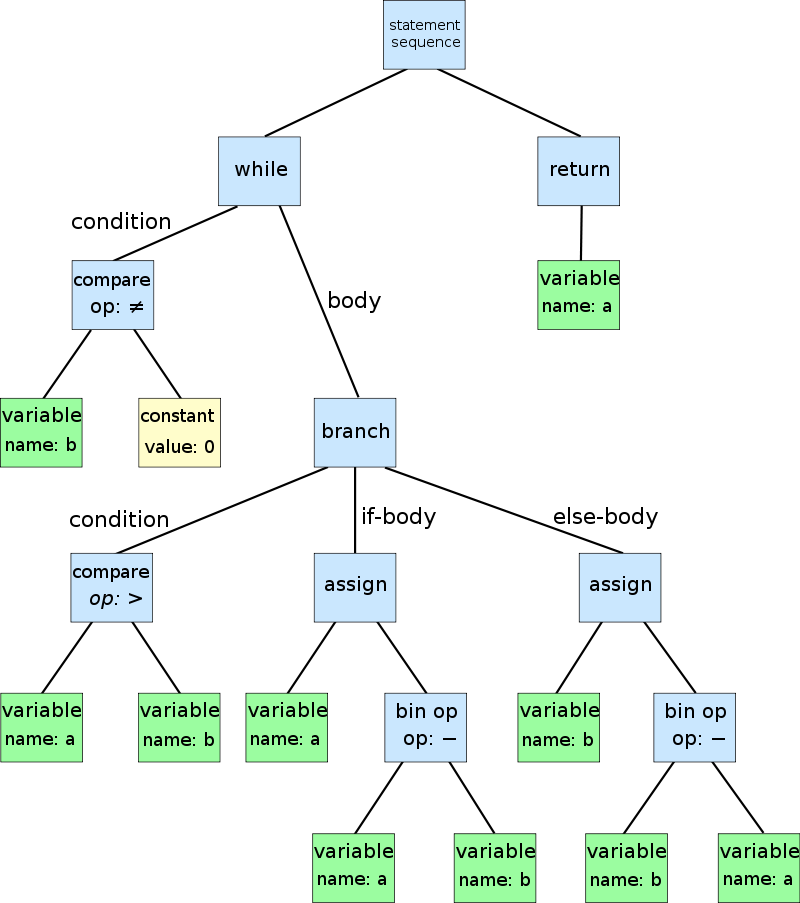
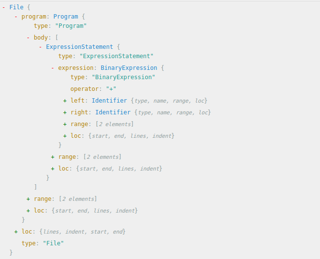
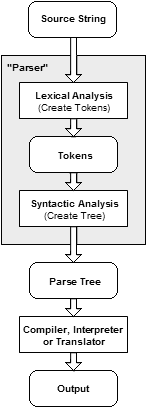

## TL;DR

- Facebook 为了解决「大型代码库」迁移，基于 AST 造了个工具 **Codemod**
- 基于 Codemod 又构建了 JavaScript 代码迁移专用的工具 **jscodeshift** 和 **React-codemod**
- 理解这些工具背后的原理有助于从一个单纯的「API 使用者」变成一个工程师般的「创造者」
- Demo Time！Let's write a codemod
- 一些有价值的参考

---

## 背景

作为一个自信而自豪的前端弄潮儿（F2E），我们总是希望能够在这个每天都在飞速迭代的行业，与时渐进。
前端们是一群不安分的人，大家喜爱新框架、新语法，而 JavaScript 也是一门非常灵活的语言，它提供给我们的 API 也在与时渐进。比如，当 `ES2015 / ES2016 / ES2017…` 出来的时候，那些新语法糖，简洁漂亮，且更易于理解逻辑，于是我们都想去尝试下。
但是尝试归尝试，对于新项目尝试起来成本很低，只需要把新功能都用新语法编写就好。
而创建新项目的同时，其实我们也在维护着一些已有的旧项目。如果你还并没怎么理它们，可能它们还活得不错。但是一旦 PM 心情好想加个新功能，或者你哪天心情好想去更新下代码库，然后看到自己之前写的那些代码，那些现在其实可以更优雅漂亮的代码，是不是手里特痒痒特想把它们更新了？
执行力强的小伙伴可能说干就干了。嗯，就假设我们有个项目，里面使用的是用`ES5` 版 `React` 作为 `UI View`层，然后它大概四个页面`(Page)`，每个页面包含大概四个组件`(Component)`，然后你从某个看起来比较小、不容易出错的`Component` 入手，开始一行一行改写代码，嗯，`var React = require('react’)` 改为 `import React from 'react’`， `var API = ‘/j/app/xxx’` 改为 `const API = ‘/j/app/xxx’`，`var foo` 改为 `let foo`，`function () {…}` 改为 `() => {…}`，`module.exports = React.createClass({…})` 改为 `export default class MyComponent extends React.Component {…}` …
天哪，有完没完，一个组件改完下来，你已经感到身体被掏空，望了望 `Components` 列表，更不用说，重新 `build` 过的测试还没过。你陷入了绝望...

那么有没有更快一点的办法呢？
稍微有点经验的前端儿可能想到「正则表达式匹配替换」。Bash `Awk | Sed` 命令，或者 Vim `:%s/var/let/g`。可是如果需要有些变量是 `const` 类型，有些是 `let`，而有些保持 `var` 不变怎么办？再比如说以下这段很常见的代码：

```javascript
merge(a, {b: 1}, c);  // Old

// 需要变为

({...a, b: 1, ...c});  // New
```

这里光是这个函数的 `arguments` 就可能有多种形式，比如 `variable`，一个匿名函数返回的 Object 或者 `Plain Object` 那种。
所以这里已经相当于是一个 `Context-non-free` 的问题，也就是说，**上下文语义**很重要。
这样的话，无论再怎么强大的`RegExp` 也无能为力。因为正则的本质，其实是根据一定的 `Pattern` 来匹配字符串，但是在真正的代码里，所有的字符串都有语义，都有上下文，这里的正则表达式会既复杂又无用。
所以，我们得**升一个维度**思考问题。

## Codemod

对「代码库的批量迁移更新」，其实也是程序员的一个需求，所以，很感恩地，已经有一群懒惰又聪明的程序员造出了工具：**Codemod**，将「大型仓库代码的批量迁移」自动化，省时省力。

好吧，所以 **Codemod** 到底是什么呢？
官方文档这样写着：

> Codemod is a tool/library to assist you with large-scale codebase refactors that can be partially automated but still require human oversight and occasional intervention.

这样看来，可以很好的解决我们的需求了。
基于 Codemod，又出现了针对 JavaScript 代码迁移的工具 [Facebook jscoodeshift](https://github.com/facebook/jscodeshift)，
基于 **jscodeshift**，又构建了迁移一般 JavaScript 代码（比如 ES5 -> ES2015) 的工具 [js-codemod](https://github.com/cpojer/js-codemod) 和迁移 React 相关项目的 [react-codemod](https://github.com/reactjs/react-codemod)。

嗯，这么看来，我们的事情就变得容易多了。
根据上面那些工具的官方文档，我们只需要按顺序执行以下命令：

```shell
> npm i -g jscodeshift
> git clone https://github.com/reactjs/react-codemod.git
> git clone https://github.com/cpojer/js-codemod.git
> jscodeshift -t react-codemod/transforms/class.js --mixin-module-name=react-addons-pure-render-mixin --flow=true --pure-component=true --remove-runtime-proptypes=false src/register/component/myComponent.jsx
> jscodeshift -t js-codemod/transforms/no-vars.js ./src/register/component/myComponent.jsx
```

然后，再次 `git status` 一下或者直接打开刚才 transform 的 `myComponent.jsx` 文件查看，你会发现，Wow，神奇般，你的代码都成为了它们应该成为的样子！

这里暂时以我之前做的 Accounts 项目为例：
https://github.intra.douban.com/accounts/accounts/pull/553/files#diff-b2286efdea6a62288250264e82bd948b

基本步骤如下：

1. 因为是第一次使用 `codemod`，所以比较谨慎，一个一个 `component` 来；
2. 先用 `react-codemod` 转，把大部头代码迁移；
3. 然后 `js-codemod` 小步更新整理；
4. 然后再根据一些自己的 Code Style 做些细节上的修改。比如使用 `standard-format` 工具格式化代码，符合我个人写的代码风格。
5. 毕竟 JS 太过于灵活，每个人写代码时候风格和结构都是各异的，有时候的转换还是会出现一些与想象中不一致的结果，官方文档也是说仍然需要人工干预，所以会根据 transform 后的结果手动修改下代码细节；
6. 一切组件迁移就绪，`npm run test` 测试通过以后，重新 `build` 运行

这里我把已有的十几个组件和页面文件，全部使用上面的工具进行了更新。
然后当你重新 `build` 后，你会发现测试仍然通过，组件功能仍然 work，但是代码库却是使用新语法糖进行了大规模彻彻底底地更新！简直太神奇了！🤓
那么，它是怎么做到的呢？
这里就要好好深究下这个工具了。


## jscodeshift

让我们来重新读一下 jscodeshift 的[文档](https://github.com/facebook/jscodeshift#jscodeshift-)。

> jscodeshift is a toolkit for running codemods over multiple JS files. It provides:

- A runner, which executes the provided transform for each file passed to it. It also outputs a summary of how many files have (not) been transformed.
- A wrapper around recast, providing a different API. Recast is an AST-to-AST transform tool and also tries to preserve the style of original code as much as possible.

那么这里就出现了两个关键的概念：*Runner* 及 *AST*。

- **Runner**
- > A runner/worker feature that can apply transforms to thousands of files in parallel.
  > -- [CPojer Effective JavaScript Codemods](https://medium.com/@cpojer/effective-javascript-codemods-5a6686bb46fb#.sg03sd9eq)

- **AST**，Abstract Syntax Tree，抽象语法分析树。

为了更好理解以上概念，先来看一下之前运行 jscodeshift 命令过程。
我们先是把一个里面包含了 JS 代码的源文件传给了它，然后它读取了源代码，又根据写好的 `transform.js` 对源代码进行了相应的变换，最后输出了变换后的 JS 代码，覆盖了原文件。
这个过程简单的说，就是：
`SourceCode => codemod => ObjectCode`

那么再详细一点，根据 jscodeshift 作者之一的 CPojer 在一次 JSConf 上对这个工具的介绍，jscodeshift 操作基本是按以下过程：
`Parse => Find => Create => Update => Print`

1. **Parse**: SourceCode => AST （Tree Nodes)
2. **Find**: Find the Nodes we want to replace         // Transform
3. **Create**: Create the New Nodes we want to insert  // Transform
4. **Update**: Update the AST at the right location    // Transform
5. **Print**: Print it back into JavaScript Source with proper formatting and should like human wrote this.

### 第一步，将源代码解析 (parse) 成 AST.

现在我们先回到语言的本质。

我们知道自然语言（Natural Language)，无论什么语种，都会有「主语」「动词」「宾语」「标点符号」来描述一个现实世界所发生的事件。
而在计算机编程语言 (Programming Language)，无论什么语种，都会有「类型」「运算符」「流程语句」「函数」「对象」等概念来表达计算机中存在内存中的0和1，以及背后运算与逻辑。

不同的语言，都会配之不同的**语法分析器**(parser)。

对于自然语言，我们的大脑就是一个 Parser。

对于编程语言，语法分析器是把源代码作为字符串读入、解析，并建立语法树的程序。

什么是**语法树**？摘自 Wiki 一段：

> 计算机科学中，抽象语法树（abstract syntax tree 或者缩写为 AST），或者语法树（syntax tree），是源代码的抽象语法结构的树状表现形式，这里特指编程语言的源代码。树上的每个节点都表示源代码中的一种结构。之所以说语法是「抽象」的，是因为这里的语法并不会表示出真实语法中出现的每个细节。

这么说其实还是有点抽象，我们先打开 [wiki](https://en.wikipedia.org/wiki/Abstract_syntax_tree) 看到 wikipedia 这个图，




前端er 一定会觉得很相似，这里不就是 DOM 语法树的终极抽象版本吗，只是把一个个 DOM Nodes 换成了一个个更加无语义的字符 Token。
FB 有一个很棒的工具 [ASTExplorer](http://astexplorer.net/)，可以用来更形象地展示。

比如说，我们现在就只有一个很简单的表达式`a+b`，这里是 recast Parser 解析后的 AST 结构：



看上去特别复杂。注意那些蓝色字体 `File`, `Programme`,` ExpressionStatement`,` Identifier`… 这些都是 AST Nodes，其他的都是和这个 Node 相关的数据。

根据前文可以知道，每种语言的 AST 都是不同的。有专门的 Parser 来生成 AST。

关于 [Parser](https://en.wikipedia.org/wiki/Parsing#Parser) 又是一门很深的学问了。

在 ASTExplorer.net 上可以看到有很多 parser，比较著名的有 [Esprima(jQuery)](https://github.com/jquery/esprima/blob/master/src/parser.ts)，Uglify-JS, Babylon(Babel), Acorn(Tern / Webpack), 及 jscodeshift 使用的 recast。

虽然有很多 Parser，但是基本上，一个 parser 的结构都差不多，对源代码进行词法分析，生成 Tokens，对 Tokens 进行语法分析，然后生成 AST。



具体可以参考看下 [Esprima Parse Demo](http://esprima.org/demo/parse.html#)。
生成的 AST 都遵循一个统一标准 [ESTree](https://github.com/estree/estree/blob/master/es5.md) or [Mozilla SpiderMonkey](parser API https://developer.mozilla.org/en-US/docs/Mozilla/Projects/SpiderMonkey/Parser_API)，也就是说都会返回一个 ESTree Compatible AST。

### 第二三四步，对生成的 AST 进行操作修改 (Find Nodes & Create New Nodes & Update Nodes)

Wiki 有介绍说，parse AST 的代码基本是使用`Visitor Pattern`（游客模式），如：

```javascript
// recast
var ast = recast.parse(src);
recast.visit(ast, {
visitIdentifier: function(path) {
	// do something with path
	return false;
}
});
```

这其实也很容易理解，AST 就是一个树形结构，然后解析它的话就是以一个游客一样遍历这棵树。

但是这个模式在前端中还是用得比较少的，所以 `js-codeshift` 基于 [Collections](https://github.com/facebook/jscodeshift#collections-and-traversal) 概念，很贴心的给这些 Parser API 继续包了一层，提供了一个不一样的前端友好型 API.

```javascript
// jscodeshift
jscodeshift(src)
	.find(jscodeshift.Identifier)
  	.forEach(function(path) {
      // do something with path
});

// Provide jQuery-likely and F2E-friendly Syntax API
// Manipulate AST nodes conveniently.
```

读这段代码的时候，一下子觉得又似曾相识。这不就和使用 `jQuery` 操作 DOM 一样嘛。

可以对比下 “普通 Parser” 与 jscodeshift 操纵 AST 的区别：

可以看到如果使用 [esprima](http://esprima.org/) ，AST Traverse / Walk 基本是 `visitor pattern`.
https://github.intra.douban.com/zhangbinliu/ast_demo/tree/esprima


### 第五步，输出转换后的代码

据 jscodeshift 创造者之一 CPojer 说，根据转换后的 AST，以及一些输出 [Options](https://github.com/benjamn/recast/blob/52a7ec3eaaa37e78436841ed8afc948033a86252/lib/options.js#L61)（比如是否单引号、tab 宽度是多少、需不需要去掉尾部分号…），是一个挺困难的过程。
但是最终，jscodeshift 的输出 API 却简洁明了，只要一行代码即可搞定。

```javascript
.toSource({quote: 'single'}); // sets strings to use single quotes in transformed code.
```

（其实 Recast 在这做了[大量的工作]((https://github.com/benjamn/recast/blob/master/lib/printer.js) )）

经过这五个步骤，一次 jscodeshift 的转换过程就算完成啦。


## DEMO TIME!  Write a codemod transform

```shell
jscodeshift -t <transform.js> /to/file/path
```

我们来写`transform.js`，也就是说，你打算使用 jscodeshift 对源代码进行何种变换，这里面就是变换函数。

现在考虑一个 ES5 -> ES6 的经典问题：

#### Problem:

<code>
// Before
'Hello, ' + name + ', I am a string.'
// After
`Hello, ${name}, I am a string.`
</code>

#### Solution:

1. Simplify， 考虑一个最简单的情况

<code>
// Before
a + b
// After
`${a}${b}`
</code>

`a + b` AST:


`${a}${b}` AST:


对比两个 AST 可以发现，我们只需要

1. 读入需转换的代码，找到 `BinaryExpression`
2. 保存 `BinaryExpression` 左右两边的值（node.left & node.right)
3. 生成一个为 `TemlateLiteral` Node，`quasis` 是一个包含了三个 `TemplateElement` 的数组，`cookde & raw keys` 都是 `''`， `expressions` 是一个包含 node.left, node.right 值的数组。
4. 然后将它返回输出；

这里贴下我的 Solution Example:
1. http://astexplorer.net/#/gist/33b63b7dc8da6d9ea4936c631adc994d/7905ef5b30dfc0cb3c811af8a8960f11014ef402
```javascript
export default function transformer(file, api) {
  const j = api.jscodeshift;
  const root = j(file.source)

  const toTempLiteral = (p) => {
    const quasis = [
     j.templateElement({"cooked": '', "raw": ''}, false),
     j.templateElement({"cooked": '', "raw": ''}, false),
     j.templateElement({"cooked": '', "raw": ''}, true),
    ]

    const tempLiteral = j.templateLiteral(quasis, [p.node.left, p.node.right])

    return tempLiteral
  }

  return root
    .find(j.BinaryExpression, {operator : '+'})
  	.replaceWith(toTempLiteral)
    .toSource()
}
```

2. http://astexplorer.net/#/gist/a71957902ec1fd79f199eb37e5e6801a/55c4910295973b3a4d09770d94cec73d5096daa4

```javascript
export default function transformer(file, api) {
  const j = api.jscodeshift;
  const root = j(file.source)

  const toTempLiteral = (p) => {
    const quasis = [
     j.templateElement({"cooked": '', "raw": ''}, false),
     j.templateElement({"cooked": '', "raw": ''}, false),
     j.templateElement({"cooked": '', "raw": ''}, true),
    ]

    const extractNodes = (node) => {
     if (node.type === 'BinaryExpression' && node.operator === '+') {
     	return [...extractNodes(node.left), ...extractNodes(node.right)]
     }
     else { return [node] }
    }

    const tempLiteral = j.templateLiteral(quasis, extractNodes(p.node))

    return tempLiteral
  }

  return root
    .find(j.BinaryExpression, {operator : '+'})
  	.replaceWith(toTempLiteral)
    .toSource()
}

```


3. http://astexplorer.net/#/gist/a71957902ec1fd79f199eb37e5e6801a/cf3c898c5fe494d08a978dd1a3a3e56fc42828a8

```javascript
export default function transformer(file, api) {
  const j = api.jscodeshift;
  const root = j(file.source)

  const toTempLiteral = (p) => {
    const quasis = [
     j.templateElement({"cooked": '', "raw": ''}, false),
     j.templateElement({"cooked": '', "raw": ''}, false),
     j.templateElement({"cooked": '', "raw": ''}, true),
    ]

    const extractNodes = (node) => {
     if (node.type === 'BinaryExpression' && node.operator === '+') {
     	return [...extractNodes(node.left), ...extractNodes(node.right)]
     }
     else { return [node] }
    }

    const tempLiteral = j.templateLiteral(quasis, extractNodes(p.node))

    return tempLiteral
  }

  return root
    .find(j.BinaryExpression, {operator : '+'})
  	.replaceWith(toTempLiteral)
    .toSource()
}

```

官方没有太详细的 transform 编写指导，可以多谷歌或者学习已编写好的 transform：`react-codemod/tranform` 或者 `js-codemod/transform`。

我个人觉得写 JS-Codeshift Transform | Babel-Plugin 本质其实就是对比两棵语法树，像解谜一样，看看如何「又好又快」变换成这样。

剩下的一开始如何读取源 JS 代码并解析成语法树，具体在 AST 上 traverse & find & create & update （这里我猜测其实是一个递归遍历节点树的过程？），及之后如何按一定的 code style 生成我们需要的代码，都是透明且不关心的。


## 总结 & 开脑洞
- 总结下基本处理流程：
  

- AST 是很有用的一个抽象概念。一旦你理解了这些规则，唯一的限制就是解析器和你的想象力。
- 纯 AST parse 太过于理论，既然是工程师，还是需要自己动手写点什么来解决自己实际遇到的问题。
- 可以继续拓展到「语法高亮」、「关键字匹配」、「代码格式化」、「作用域判断」、以及「代码压缩」、「Babel 插件」等等。
- 渐渐深入底层进行分析，让自己对这门语言有了更多、更深入的了解，可以更好地成为产品「创造者」，而不单纯是「使用者」。
- **Write JavaScript that writes JavaScript! The best editor is JavaScript. Cool!**


## 思考

- 可以在一个 codemod transform 里面同时进行两个变换吗？个人觉得可能会很复杂且效果不太好，因为有些 transform 并不是正交的。🤔


## Refs:

- [CPojer’s Talk](https://www.youtube.com/watch?v=d0pOgY8__JM)
- [Effective JavaScript Codemods](https://medium.com/@cpojer/effective-javascript-codemods-5a6686bb46fb#.s5kdne4xl)
- [Codemod Interview](https://survivejs.com/blog/codemod-interview/)
- [How to write a codemod](https://vramana.github.io/blog/2015/12/21/codemod-tutorial/) 结合 CPojer’s Talk, 这个虽很长但很有用！
- [Understanding Babel Plugin](https://www.sitepoint.com/understanding-asts-building-babel-plugin/)
- [AST 在美团的应用](http://tech.meituan.com/abstract-syntax-tree.html)
- [imweb](http://imweb.io/topic/57b13b4f93d9938132cc8dfd)

